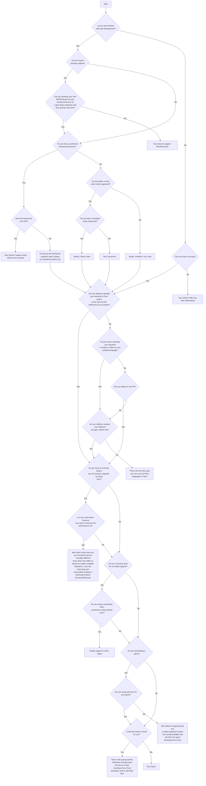

```mermaid
flowchart TD
    Start[Start] --> WebTech{Is your team familiar\nwith web development?}
    WebTech --> |Yes| Browser{Do you require\nbrowser support?}
    WebTech --> |No| Egui{Can your team use Egui?}
    Egui --> |Yes| BackendLanguage{Are you willing to develop\nyour backend in Rust and/or\nis the Tauri JS API\nsufficient for your project?}
    Egui --> |No| EguiEx
    EguiEx[Tauri doesn't offer any other alternatives]
    Browser --> |Yes| Wasm{Can you develop your own\nWASM library for your\nfrontend that acts as\na glue library between web\ntech and the Tauri API?}
    Browser --> |No| PreferFramework{Do you have a preferred\nfrontend framework?}
    Wasm --> |Yes| PreferFramework
    Wasm --> |No| WasmEx
    WasmEx[Tauri doesn't support WASM directly]
    PreferFramework --> |Yes| PreferFrameworkSSR{Does the framework\nuse SSR?}
    PreferFramework --> |No| PFCodeCentric{Do you prefer a more\ncode centric approach?}
    PFCodeCentric --> |Yes| PFTypescript{Do you want to develop\n using Typescript?}
    PFCodeCentric --> |No| PFCodeCentricNo
    PFCodeCentricNo[Svelte, SvelteKit, Vue, Nuxt] --> BackendLanguage
    PFTypescript --> |Yes| PFTypescriptYes
    PFTypescriptYes[Solid.js, React, Next] --> BackendLanguage
    PFTypescript --> |No| PFTypescriptNo
    PFTypescriptNo[Yew, Sycamore] --> BackendLanguage
    PreferFrameworkSSR --> |Yes| PreferFrameworkSSRExYes
    PreferFrameworkSSRExYes[Tauri doesn't support using\nSSR for the frontend]
    PreferFrameworkSSR --> |No| PreferFrameworkSSRExNo
    PreferFrameworkSSRExNo[As long as the framework\nsupports static hosting\nyou should be good to go] --> BackendLanguage
    BackendLanguage --> |Yes| UpgradeExisting{Do you have an existing project\nyou are trying to upgrade by using\nTauri?}
    BackendLanguage --> |No| BLScripted{Do you want to develop\nyour backend\n in Node.js, Python or any\nscripted language?}
    BLScripted --> |Yes| BLRestAPI{Are you willing to expose your backend\nthrough a REST API?}
    BLScripted --> |No| BLCoded{Are you willing to use FFI?}
    BLCoded --> |Yes| UpgradeExisting
    BLCoded --> |No| BLRestAPI
    BLRestAPI --> |Yes| UpgradeExisting
    BLRestAPI --> |No| BLRestAPIEx
    BLRestAPIEx[These are the only ways\nyou can use non-Rust\nlanguages in Tauri]
    UpgradeExisting --> |Yes| UEIsItFront{Is it your web based frontend\nyou want to enhance the\nperformance of?}
    UpgradeExisting --> |No| MobileSupport{Are you choosing Tauri\nfor its mobile support?}
    UEIsItFront --> |Yes| UEIsItFrontEx
    UEIsItFrontEx[Bad code is bad code and your frontend wont be noticably different\nsince what Tauri offers is based on system installed webviews. Look into improving your\ncode quality instead or switching frontend framework/libraries]
    UEIsItFront --> |No| MobileSupport
    MobileSupport --> |Yes| MobileSupportAlpha{Do you require something that's\nproduction ready anytime\nsoon?}
    MobileSupport --> |No| GameDev
    MobileSupportAlpha --> |Yes| MobileSupportAlphaEx
    MobileSupportAlphaEx[Mobile support is still in Alpha]
    MobileSupportAlpha --> |No| GameDev{Are you developing a game?}    
    GameDev --> |Yes| GameDevWebTech{Are you using web tech for your game?}
    GameDev --> |No| JobMarket{Is the job market a factor\nfor you?}
    GameDevWebTech --> |Yes| JobMarket
    GameDevWebTech --> |No| GameDevWebTechEx
    GameDevWebTechEx[Tauri doesn't support giving you\na native graphical context\nYou should probably look\ninto Bevy for game\ndevelopment in Rust]
    JobMarket --> |Yes| JobMarketEx
    JobMarketEx[Tauri is still young and the likelihood of being hired\nnot just as a Tauri developer but a Rust\ndeveloper at all is still fairly slim.]
    JobMarket --> |No| PickTauri
    PickTauri[Pick Tauri!!]
  
```
